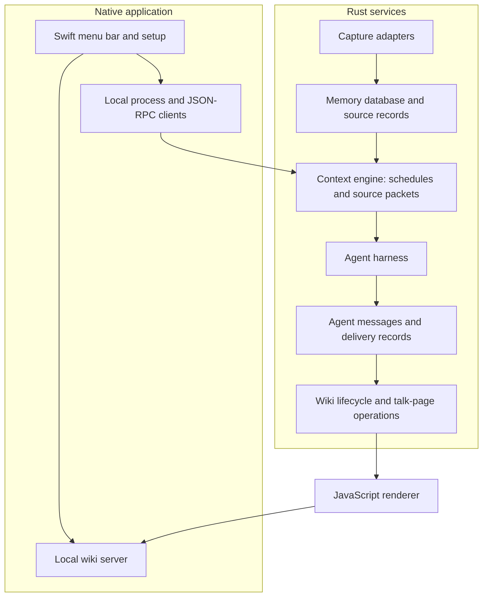
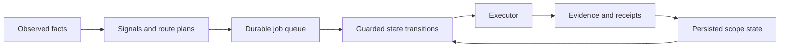

# 1Context — local context for AI agents

**An inspectable memory layer that connects captured activity, agent work, and a local wiki.**

Built by **Jackie Oliver** at Haptica. I built the platform and its agent-workflow experiments: the native application boundary, context processing, durable workflow control, and readable memory surfaces.

**Rust · Swift/macOS · JavaScript · Python · PostgreSQL/SQLite adapters**

The interesting engineering problem is keeping a useful record of work across agent sessions without treating generated text as an unquestionable source of truth. The code separates source ingestion, agent execution, evidence, and publication. Article pages expose current context; talk pages preserve proposals and discussion.

## Architecture



This describes the implemented component boundaries, not a claim of a fully automatic capture-to-memory product. The upstream preview described collection and memory writing as manual. This edition includes engine code but excludes personal runtime prompts, populated wikis, accounts, capture logs, and release packaging.

### Separate Python workflow experiments

The [workflow-experiments](workflow-experiments) subtree is a separate development snapshot, not a second runtime secretly required by the native app.



The experiment makes control flow deterministic around nondeterministic agent outputs: transitions, retry decisions, and completion checks are inspectable and replayable.

## Read the implementation

| Start here | What to inspect |
| --- | --- |
| [Capture core](crates/onecontext-capture-core/src) | Source adapters, normalization, and synthetic fixtures. |
| [Memory database](crates/onecontext-memory-db/src) | Session ingestion, object writes, and schema. |
| [Context engine](crates/onecontext-context-engine/src) | Source packets, scheduling, agent execution, and persisted run state. |
| [Agent mail](crates/onecontext-agent-mail/src/lib.rs) | Stable message identities, delivery state, and rebuildable mailbox indexes. |
| [Wiki core](crates/onecontext-wiki-core/src) | Page lifecycle, talk operations, validation, tombstones, and restore. |
| [Wiki renderer](wiki-engine/src/renderer) | Markdown rendering, route metadata, references, and reader/agent surfaces. |
| [Native clients](macos/Sources) | Permissions, local processes, setup, and UI boundaries. |
| [Python state machines](workflow-experiments/src/onectx/state_machines) | Queue persistence, guards, execution, and evidence-driven transitions. |

## Engineering decisions

- **Keep orchestration outside the UI.** Native clients communicate with service processes; UI lifecycle and agent work have separate boundaries.
- **Keep memory inspectable.** Source records, proposals, messages, and rendered pages remain distinct objects rather than one continually overwritten prompt.
- **Make retries and recovery explicit.** Stable identities and stored receipts let a workflow distinguish missing work from work already completed.
- **Treat publication as an operation.** Wiki validation and lifecycle rules stand between source edits and a reader-visible result.
- **Keep experiments legible.** The Python control fabric is labeled separately so a reviewer can assess its mechanics without mistaking it for a deployed native integration.

## Run focused checks

Requires Rust, Node.js, and Python 3.11+ with `uv`. These commands do not need personal data or provider accounts.

```sh
cargo test -p onecontext-capture-core -p onecontext-wiki-core -p onecontext-agent-mail --lib
cd wiki-engine
npm ci --ignore-scripts
npm test
cd ../workflow-experiments
uv run pytest -q tests/test_state_machine_runtime.py tests/test_state_machine_runtime_executor.py tests/test_state_machine_mermaid.py tests/test_memory_replay.py tests/test_session_import_retention.py
```

On October 6, 2026: **99 selected Rust tests, all 28 wiki-renderer tests, and 30 Python core tests passed**. The experimental Python snapshot is incomplete beyond those focused checks; see its [validation notes](workflow-experiments/README.md). This is not a complete working product distribution. Full native builds, PostgreSQL integration, live agent execution, and release installation were not verified in this pass.

See [publication scope](PUBLICATION.md) for exclusions and provenance. The Apache-2.0 license is retained.
